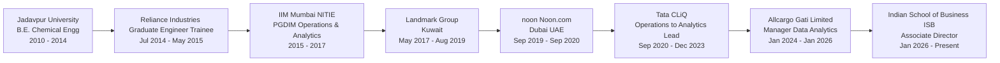

# Arani Das

**Leading Analytics & Data Science at ISB**

[das.arani@gmail.com](mailto:das.arani@gmail.com) · [+91 8017014853](tel:+918017014853) / [+91 7700927247](tel:+917700927247) · [linkedin.com/in/arani-das](https://www.linkedin.com/in/arani-das)

---

## Executive Profile

Data-driven analytics leader with 9+ years spanning supply chain operations, logistics, e-commerce, and strategic analytics. Built high-impact analytics functions from scratch, delivering insights that shape CEO-level decisions. Combine hands-on supply chain expertise with advanced statistical and ML capabilities. Proven track record designing delivery models, optimizing networks, and scaling data-informed cultures across organizations.

---

## Career Journey

---

## Skills & Tools

| Analytics & Insights | Visualisation & Tools | Programming |
| --- | --- | --- |
| Pattern recognition, mentorship, supply chain analytics, customer segmentation, NLP, time series forecasting | Power BI, TIBCO Spotfire, Tableau, Linux CLI, Gen AI integration | Python, SQL, R, AWS, Advanced Excel, Linux CLI |

| Python Libraries | Statistical & ML | Databases & Cloud |
| --- | --- | --- |
| pandas, NumPy, matplotlib, seaborn, scikit-learn, scipy, XGBoost, Prophet, NLTK, statsmodels | Advanced statistical analysis, classification, segmentation, time series forecasting | BigQuery, Power Query |

---

## Core Competencies

| Analytics & Data Science | Strategic Leadership |
| --- | --- |
| Python, SQL, R, pandas, NumPy, scikit-learn, XGBoost. ML projects in classification, segmentation, NLP. Advanced statistical analysis. Time series forecasting (Prophet) | Building analytics functions from ground up. Embedding data culture. CEO/C-suite engagement. Cross-functional team leadership. Stakeholder alignment on data strategy |

| Analytics Infrastructure | Supply Chain & Operations |
| --- | --- |
| TIBCO Spotfire, Power BI, Tableau. AWS. Data governance. Dashboard design. Reporting automation. Analytics platform architecture | Network optimization. Delivery model design. Cost reduction. Operational efficiency. Logistics. Warehouse management. 3PL coordination |

| Technical Tools | Cross-Functional Impact |
| --- | --- |
| Python, SQL, R, AWS, Advanced Excel. Linux CLI. BigQuery. Power Query. Geofencing and mapping APIs. Gen AI integration | Data literacy programs. Mentorship. Process automation. Revenue opportunity identification. Cost optimization. Strategic reporting to leadership |

---

## Professional Experience

### Indian School of Business (ISB) — Hyderabad, India
**Associate Director, Program Analytics** · Jan 2026 – Present
- Leading analytics function for academic programs, driving data-informed decision-making for program strategy, execution, and market positioning

---

### Allcargo Gati Limited — Mumbai, India
**Manager – Data Analytics** · Jan 2024 – Jan 2026
- Built analytics function from ground up and led a nationwide team supporting Sales and Operations. Worked closely with CEO, COO, CFO, and C-suite to embed data into key strategic decisions
- Designed and rolled out nationwide delivery model, saving ₹0.05/kg (~₹50 lakh/month in cost reduction)
- Created primary KRA tool now used across India for operational KPI tracking
- Leading initiative to revamp mid-mile routes, targeting 5-10% cost savings and reducing delays to <10%
- Mapped pincodes to nearest operating units using geofencing and Google Maps API to improve serviceability
- Reduced delivery promise times by 20% using performance data, with minimal impact on on-time delivery
- Identified opportunities leading to 2-4% top-line improvement without increasing bottom-line costs
- Introduced TIBCO Spotfire across organization for analytics delivery
- First hire to establish newly created analytics division; designed team structure, tools, and delivery processes

---

### Tata CLiQ (Tata Unistore) — Mumbai, India
**Lead Data Analyst** · Jul 2022 – Dec 2023
- Led analytics team mentoring three analysts; worked closely with CEO, CBO, and COO on data capabilities
- Led ML projects on age classification, customer segmentation, and NLP analysis of call data
- Developed TAT Automation logic to optimize customer promise while maintaining operational adherence
- Optimized data structure and ticketing system: 20% reduction in analytics requests, 25% TAT reduction
- Improved retargeting algorithms, expanding eligible customer base without reducing CTR
- Conducted 5+ company-wide data literacy sessions (4.7/5 average satisfaction)
- Awarded Q1 FY2024 Fast & Frugal Tech Champion for building the Analytics & Insights team

**Category Operations Manager** · Sep 2020 – Jul 2022
- Managed supply chain processes for Electronics category; developed process guides and automated business intelligence
- ~200% increase in <3-day delivery promises YoY (FY22); ~20% increase in <7-day promises
- 4% increase in adherence to aggressively improved promises (FY22 vs FY21)
- B2B order contribution increased to >15% with <5% cancellations through GST invoicing
- ~10% man-hour reduction in PO creation through SAP process re-engineering
- Improved revenue ~₹25 lakh/year through 20% seller rejection decrease

---

### noon (Noon.com) — Dubai, UAE
**Assistant Manager, Operations** · Sep 2019 – Sep 2020
- On-boarded and trained vendors, devised SOPs, forecasted supply using SQL and R, and supervised 4 3PL warehouses. Helped design and set up e-commerce grocery warehouse
- Developed SQL (BigQuery) and R dashboards and data models for operations team
- Negotiated 3PL pricing and SLA models, achieving 10% operational cost reduction
- Devised SOPs for all Outbound and Packaging processes; standardized materials
- Designed expiry handling and return-to-vendor process; 90% wastage reduction

---

### Landmark Group — Kuwait
**Logistics Associate** · May 2017 – Aug 2019
- Led MIS team for Kuwait Centrepoint and Max warehouses, catering to 40+ stores in the Kuwait territory; served as internal consultant for supply chain initiatives
- Improved Labour Management System via compartmentalization and automatic validation for error-free operations
- Worked with IT department and TCS consultants for improving WMS system and maintaining infrastructure
- Developed R and Power Query tools to automate report generation and streamline reporting processes
- Implemented GDMS system in Babyshop Nursery catering to 250+ daily deliveries with 100% accuracy
- Prepared cost-benefit and ROI analyses for all operational process changes in the distribution centre
- Achieved 90% daily replenishment across 40+ stores through route and capacity optimization

**Warehouse Manager (additional responsibility)** · Sep 2018 – Aug 2019
- Led logistics function (team of 28) for Kuwait Centrepoint and Max e-com operations
- Managed day-to-day warehousing operations for 2 brands (5 stores, 10 staff)

---

### General Mills — Mumbai, India
**Summer Intern** · Mar 2016 – May 2016
- Affinity analysis on POS data from 5k stores using R; identified cross-selling opportunities with up to 10% potential sales increase from SKU substitutes
- Published and presented research paper at SPJIMR-POMS India Chapter Conference 2016

---

### Reliance Industries Limited — Vadodara, India
**Graduate Engineer Trainee** · Jul 2014 – May 2015
- Provided technical support for process optimization in rubber manufacturing (PBR II Plant)
- Carried out risk assessment of routine maintenance jobs and managed SAP-based work permits
- Led project to identify and eliminate defects in rubber bales
- Recognized by Process HOD for resolving leakage issues in the ammonia plant

---

### Indian Oil Corporation — Kolkata, India
**Summer Intern** · May 2013
- Study of industrial equipment and processes

---

## Education

**IIM Mumbai (NITIE)** — Mumbai, India  
PGDIM (MBA equivalent), Operations & Analytics | 2015 – 2017  
Post Graduate Diploma in Industrial Management. Score: 8.18/10

**Jadavpur University** — Kolkata, India  
B.Tech, Chemical Engineering | 2010 – 2014  
Bachelor of Technology in Chemical Engineering. Score: 7.86/10

---

## Certifications

- Python for Data Science and Machine Learning Boot-camp: via Udemy
- Six Sigma Green Belt: Certified by KPMG - 2015

---

## Hobbies & Interests

- **Quizzing:** Multi-time champion in school; active member of college and post-grad quizzing societies
- **Football:** Represented departmental teams in both academic institutions and corporate tournaments
- **Reading:** Avid reader of mythology, fantasy, sci-fi, history, and popular science; led the book society at Tata Unistore
- **Gaming:** Enjoy MOBA, RPG, turn-based strategy, and Soulslike titles; also interested in board games
- **World Cinema:** Passionate about global films and series, with a deep appreciation for cinematic craft
- Also interested in chess, photography, debating, visual arts, linguistics, history, and music
